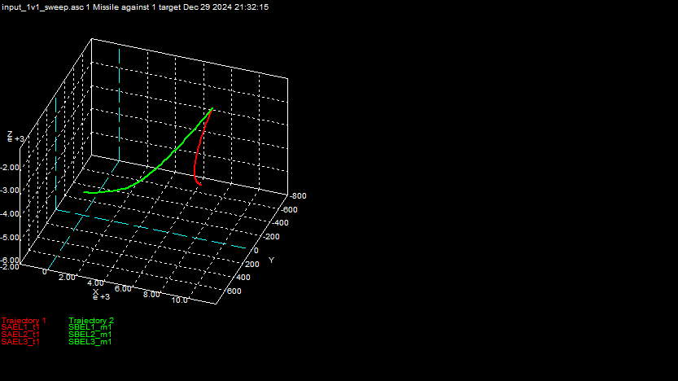
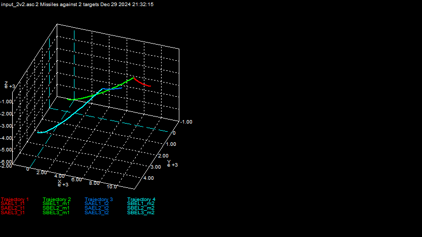
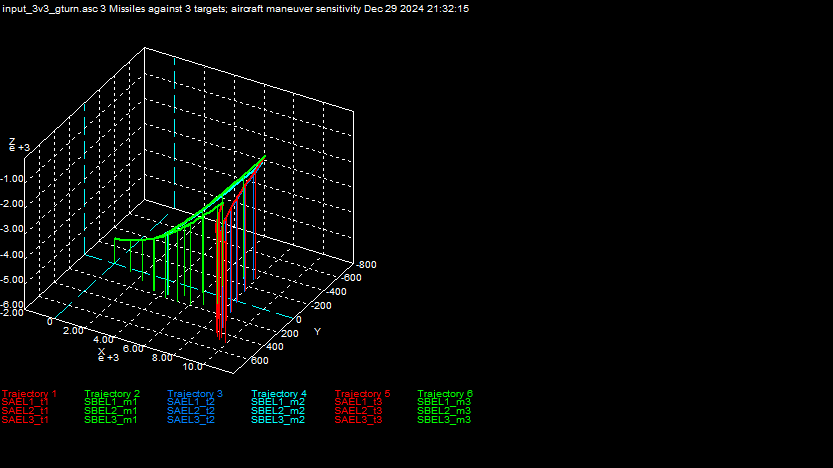

### SRAAM6

Source code available at location below.
https://arc.aiaa.org/doi/suppl/10.2514/4.102509
https://github.com/missiondesignsolutions/CADAC

Air 2 Air missiles simulation

- 6 DoF, flat Earth; local level coordinates: North, East, Down
- Air-to-air missile:
- aerodynamic tables, functions of Mach and alpha, SRAAM6 data 
- single pulse rocket motor, SRAAM6 data
- autopilot: rate and acceleration
- guidance: compensated pro-nav
- seeker: gimbaled IR seeker 

#### One missile - one target.

#### 2 missile - 2 target.

#### 3 missile - 3 target.
