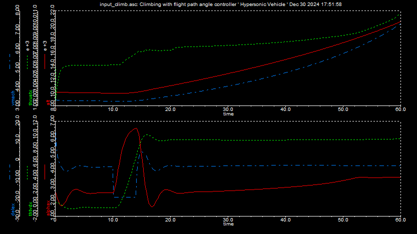
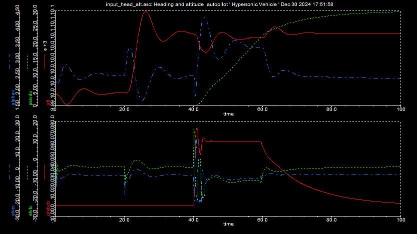

### GHAME X30 Simulation

GHAME 
- Generic Hypersonic Aerodynamic Model Example
- Single stage to orbit concept ( SSTO )

#### Test run 1
Climbing with flight path angle controller

- Frame 1 : Altitude, Thurst, Mach
- Frame 2 : Angle of attack, Flight path angle, Eelevator control

#### Test run 2
Altitude and heading change with autopilot

The result would have a 50m altitude increase at the end of the cycle and 30 deg heading change.

