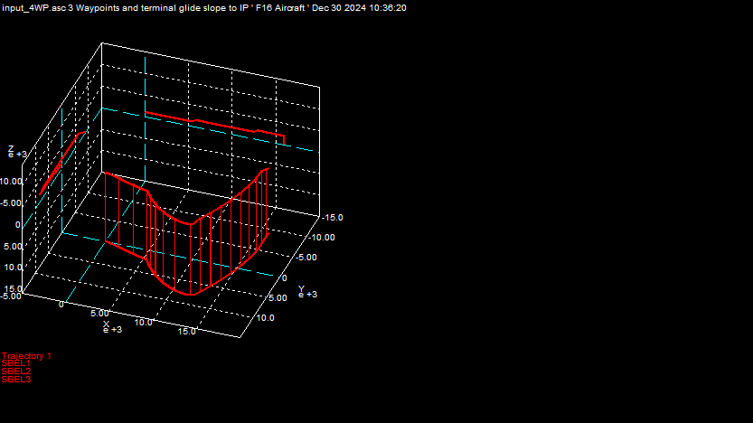
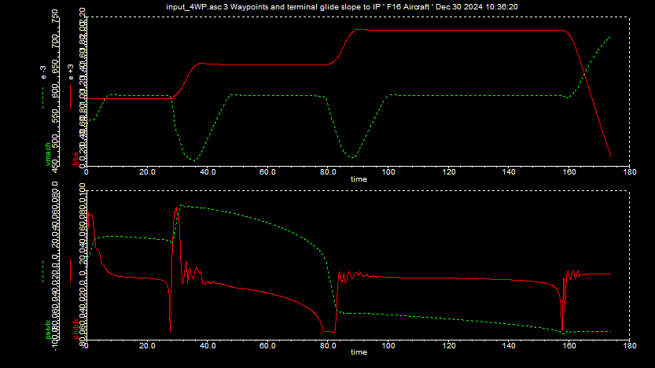
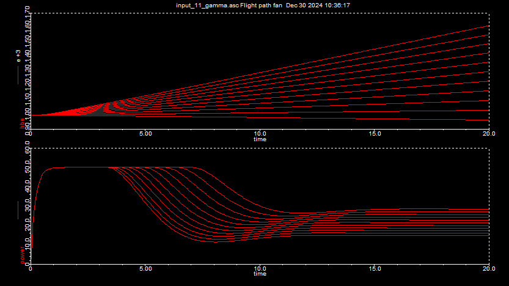
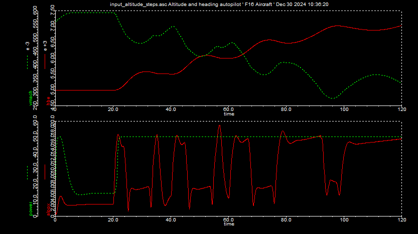

## Aircraft dynamics

|Topic|Aircraft|Missiles|
|-|-|-|
|Flying type|Back-to-turn|skid-to-turn|
|Control sufaces|3|4|
|Propulsion|Turbojet|Rocket Motors|
|Autopilot|Stable - long flight duration|Acceleration and sharp turns|
|Seekers|No|Yes|
|.|.|.|

The simulation of F16 here has the following characteristics.
- Aerodynamic model is in body co-ordinates
- Stability augmentation system
- Altitude hold autopilot
- Waypoint guidance

The F16 falcon simuation hsa the following features.
- 6 DoF
- Flat earth model
- Aero dynamics tables at 0.6 mach ( subsonic )
- Turbojet propulsion
- Autopilot : rate, heading, flight path, altitude hold
- waypoint guidance, line guidance

#### Test run 1

3 Way points with terminal guidance

Path of the flight
```
 input_4WP.asc 3 Waypoints and terminal glide slope to IP   Dec 30 2024 10:36:17
 *** Closest horizontal approach to waypoint dwbh = 1.26582 m
     Heading angle psivlx = 19.3756 deg
 *** Closest horizontal approach to waypoint dwbh = 15.5342 m
     Heading angle psivlx = -4.1161 deg
 *** Closest horizontal approach to waypoint dwbh = 2.71559 m
     Heading angle psivlx = -91.2504 deg
 *** Closest approach to IP dwb = 1.49966 m
     Heading angle psivlx = -90.0456 deg
     Flight path angle thtvlx = -30.4955 deg

```
#### 3 dim 

Positions (SBEL1, SBEL2, SBEL3)


#### 2 dim

- Top diagram represents Altitude (red) and mach (green)
- Bottom diagram represents phiblx, psivlx ( roll and heading angles )



### Flight path trajectory fan
The following run contains flight path angle set to 0,1,2..10 degrees.
The run reaches max power setting of 55 and then drops off. 



#### Altitude hold performance

- Top diagram represents Altitude (red) and mach (green)
- Bottom diagram represents phiblx, psivlx ( roll and heading angles )

Starting at 5000m altitude, command is increased in 500m steps until engine cannot maintain enough dyanmic pressure for controllability

- 7500m altitude cannot be maintained.
- Mach hold loop engaged and set at 0.6 mach.
- Max allowable POWER SETTING at 50%
- Angle of attack starts to diverge



