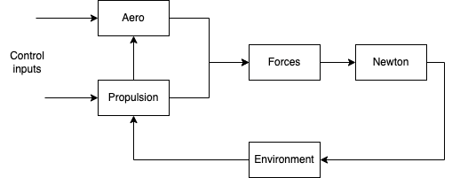

### GHAME 3

- Generic Hypersonic Aerodynamic Model Example (X30 NASA)
- Earth considered to be spherical and rotating with true latitude and longitude co-ordinates.
- Degrees of freedom (DoF - 3) 
- Trimmed aerodynamics, modelled by drag polar
- Hypersonic propulsion
- Dynamic pressure controller
- Steered  by Angle of attack and  bank angle inputs (open loop).

The following three steps will be used for calculations.

#### 3-DOF equations of motion ( Based on newtons law.)

$ m.D^I.{V_B}^I = f_{a,p} + mg $

$ f_{a,p} $ = Aero and propulsive forces \
$ mg $ = Gravity force based on mass

#### Integrated in inertial co-ordinates

$ m. \left[ \frac {d.{v_b}}{dt} \right]^I = [T]^{IG}.\left[  T \right]^{GV}.\left[ f_{a,p} \right]^V + m.\left[ g \right]^G  $

$ \left[ f_{a,p} \right]^V $  - Velocity coordinates \
$ \left[ g \right]^G $ - Geographic coordinates

#### Second integration to get position

$ \left[ \frac{dS_{BI}}{dt} \right] = [{v_B}^I]^I  $

### Component overview

#### 2 Phased climb

#### 2 Phased climb with angle 3.0

#### 4 Phased climb with Control module
