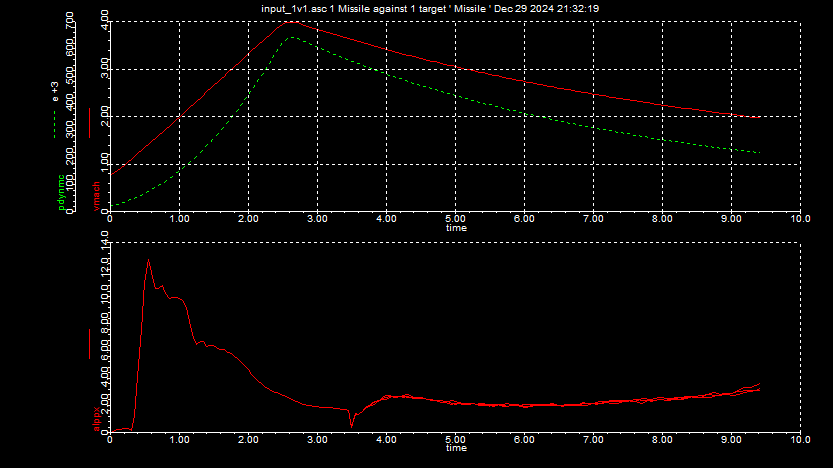
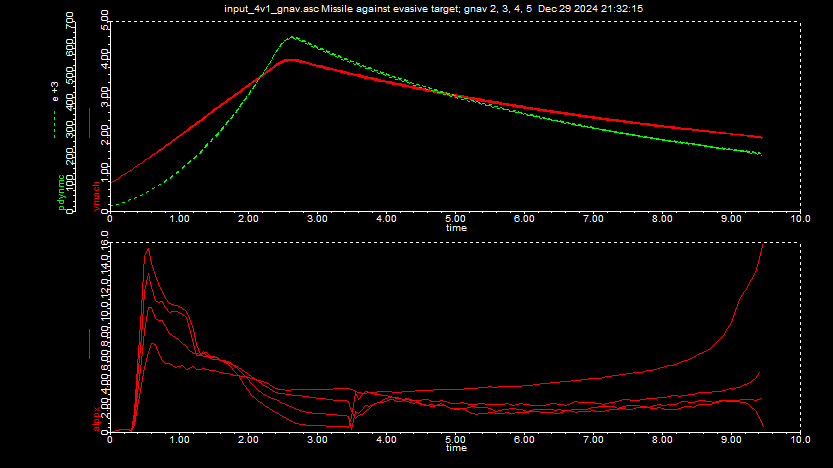
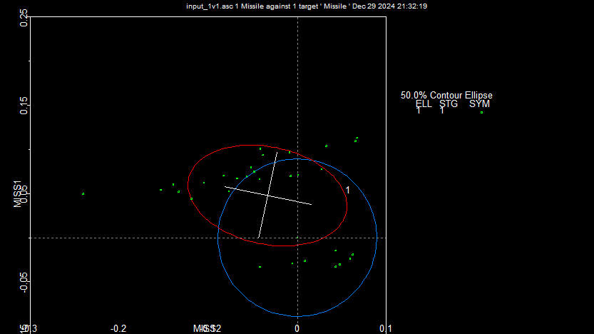
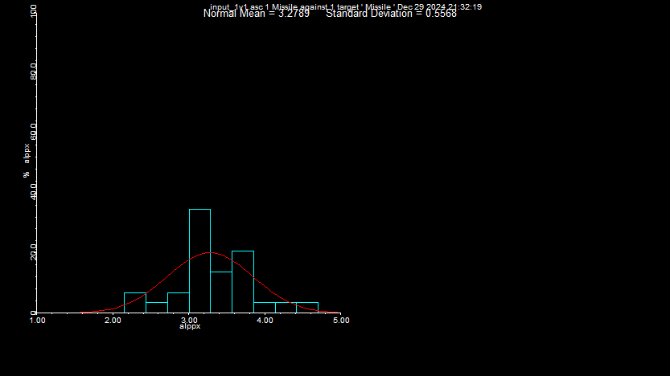
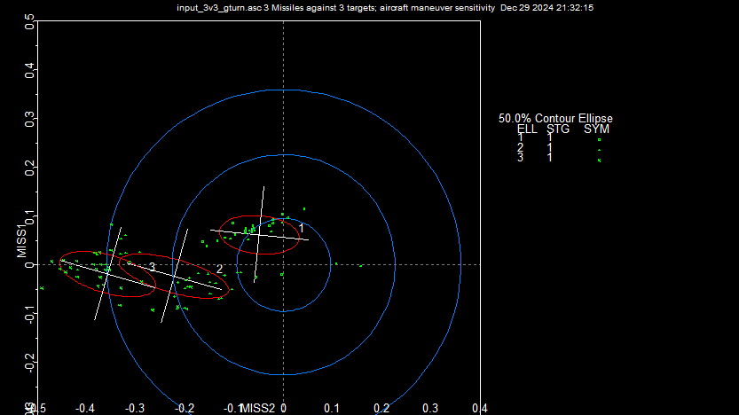
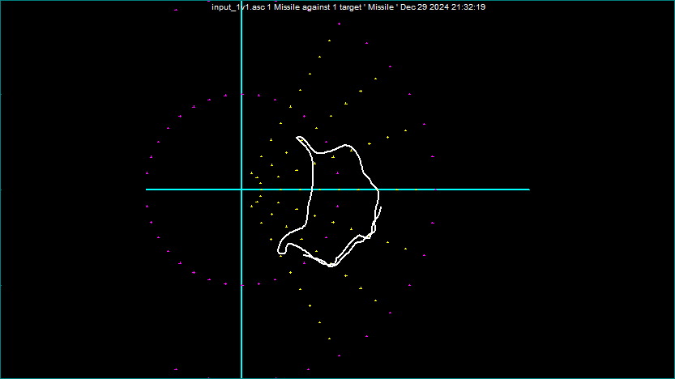

### Miss Distance analysis

#### Test run 1
- Monte caro : 3 runs
- print events and screen options

As per the top chart, the missile peaks at mach 4 and after that it goes into coach.

The bottom chart is total angle of attack (alppx) with two key points.
- Seperation of missile with peak at 12 alppx ( lines up with the target ) --> coach until 3.5s
- 3.5s sensors kick in and noise seen after



#### Test run 2

Navigation gain sensitivity
- 4 different missiles on same target 
- Different guidance gains.

Summary of the 4 missiles trajectory is as below with Missile 2 and target 1 combination having the lowest miss.

```
 *** Intercept of Blue Missile_m2 and Red Target_t1 ***
      miss in I-plane = 0.193391 m    intercept sim_time = 9.41558 sec
      down = 0.0595743 m      right = 0.183986 m
      speed = 658.649 m/s  heading = -8.54863 deg       gamma = -27.9618 deg
      differential speed = 865.409 m/s
      aspect of missile onto target aircraft: azimuth = -20.903 deg   elevation = 20.9069 deg
     Intercept condition 'trcond' = 0


 *** Intercept of Blue Missile_m3 and Red Target_t1 ***
      miss in I-plane = 2.34075 m    intercept sim_time = 9.43462 sec
      down = 1.57142 m      right = -1.73486 m
      speed = 655.121 m/s  heading = -7.37502 deg       gamma = -25.8005 deg
      differential speed = 866.452 m/s
      aspect of missile onto target aircraft: azimuth = -20.1522 deg   elevation = 19.2125 deg
     Intercept condition 'trcond' = 0


 *** Intercept of Blue Missile_m1 and Red Target_t1 ***
      miss in I-plane = 6.83425 m    intercept sim_time = 9.45229 sec
      down = 6.18988 m      right = -2.89696 m
      speed = 642.112 m/s  heading = -16.2662 deg       gamma = -37.2291 deg
      differential speed = 823.276 m/s
      aspect of missile onto target aircraft: azimuth = -25.3536 deg   elevation = 28.1553 deg
     Intercept condition 'trcond' = 9


 *** Intercept of Blue Missile_m4 and Red Target_t1 ***
      miss in I-plane = 5.43268 m    intercept sim_time = 9.46084 sec
      down = 3.51751 m      right = -4.14018 m
      speed = 651.588 m/s  heading = -6.89091 deg       gamma = -24.9154 deg
      differential speed = 864.756 m/s
      aspect of missile onto target aircraft: azimuth = -19.8184 deg   elevation = 18.507 deg
     Intercept condition 'trcond' = 9
```



#### Test run 3 
Miss distance analysis 

Bivariate analysis of variables Miss2 and Miss 1 which concludes that CEP (circular error probable) is 0.1




The histogram graph of all samples with the angle of attack is below. 


#### Test run 4
Miss sesitivity to target aircraft maneuver and as the target aircraft manuevers, the miss distance will increase.



#### Test run 5
Sweep analysis for -60 to 60 degrees window for 1 missile to 1 target and plotted as a contour of impact for launching the missile

