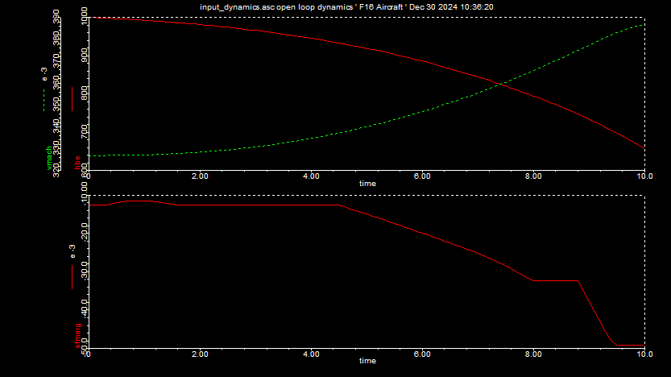
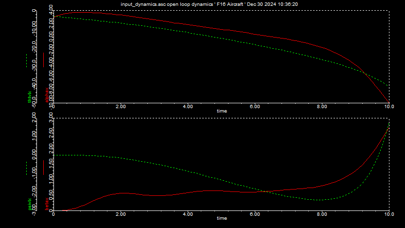
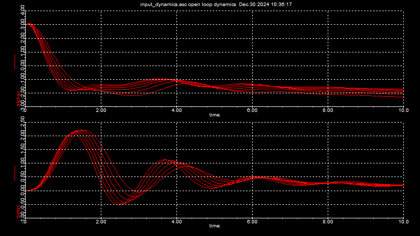
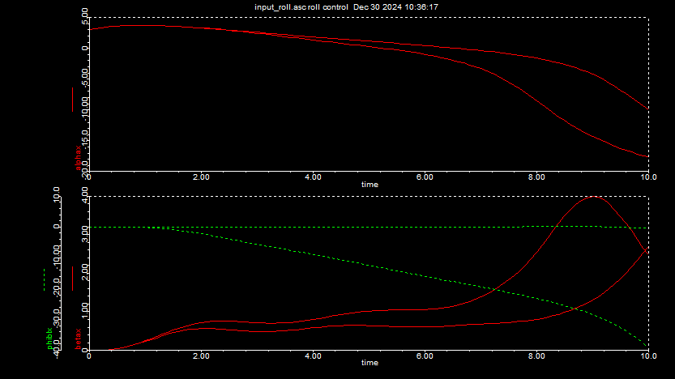
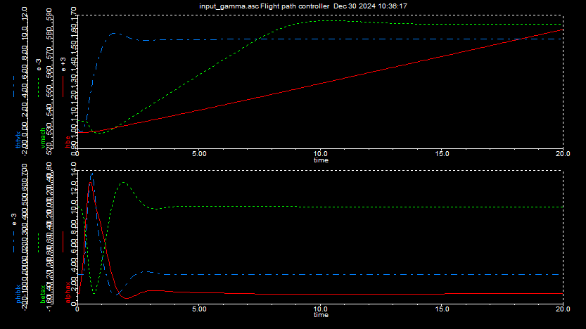
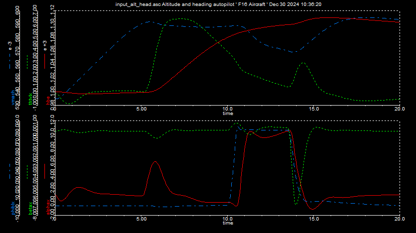
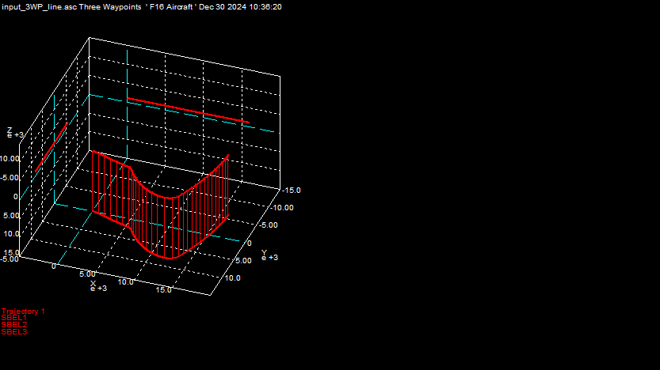
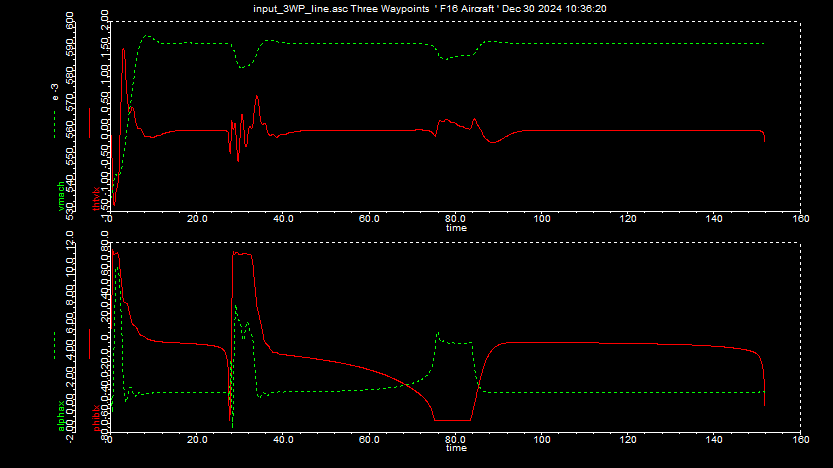

## Aircraft dynamics

|Topic|Aircraft|Missiles|
|-|-|-|
|Flying type|Back-to-turn|skid-to-turn|
|Control sufaces|3|4|
|Propulsion|Turbojet|Rocket Motors|
|Autopilot|Stable - long flight duration|Acceleration and sharp turns|
|Seekers|No|Yes|
|.|.|.|

The simulation of F16 here has the following characteristics.
- Aerodynamic model is in body co-ordinates
- Stability augmentation system
- Altitude hold autopilot
- Waypoint guidance

The F16 falcon simuation hsa the following features.
- 6 DoF
- Flat earth model
- Aero dynamics tables at 0.6 mach ( subsonic )
- Turbojet propulsion
- Autopilot : rate, heading, flight path, altitude hold
- waypoint guidance, line guidance

#### Test run 1
Unstable trajectory without controls

- Frame 1 : Altitude vs mach
- Frame 2 : Static margin

- Frame 1 : Angle of attack and flight path angle
- Frame 2 : Sideslip angle and heading angle

#### Test run 2
6 f16 simulation runs with center of gravity shifted by 0.1 each

#### Test run 3
Enable roll control only in the modules which adds actuator and control modules with mact 2, maut 1 and mroll 0 

The diagram below represents stabiilty diagram with and without roll control

Roll control does not provide stability in the pitch and yaw plane. 

#### Test run 4
Add propulsion module with gamma control with vmachcom 0.6

#### Test run 5
Attitude hold and heading autopilot modules 
The diagram below represents the following. 

- Frame 1 with hbe, thtvlx, vmach
- Frame 2 with alphax, betax, phiblx

The result below belongs to 100m climb and 45d heading change.

#### Test run 6
Way point cruise guidance through 3 way points.

The changes to path are as below. 

