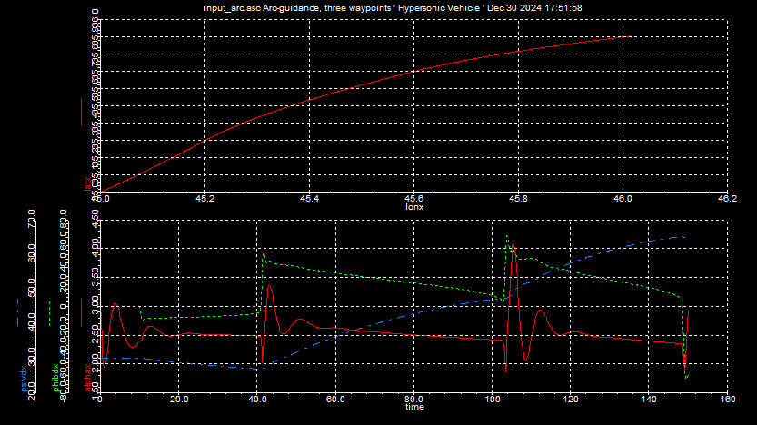
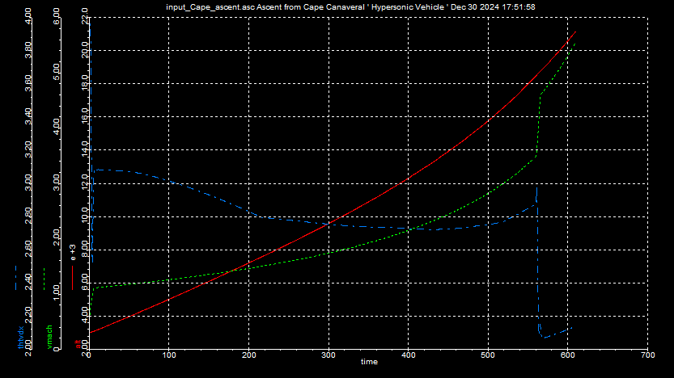
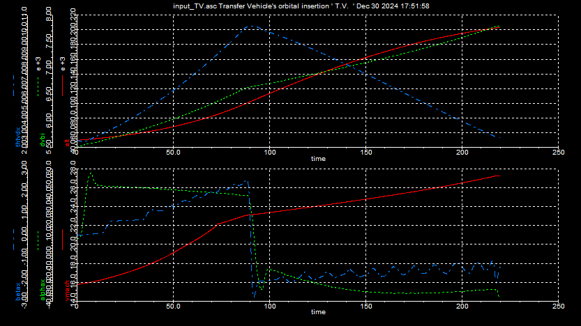
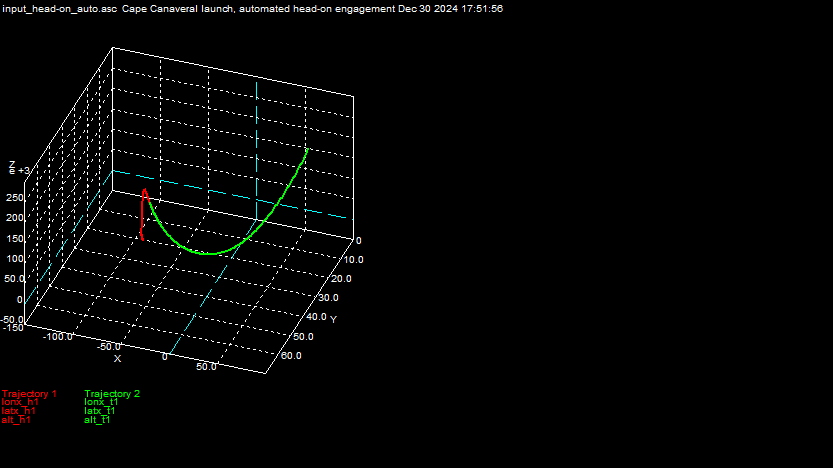
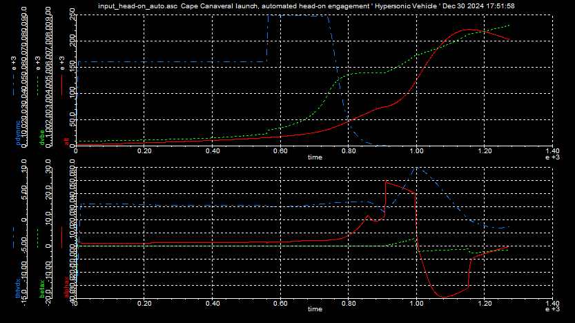

# Trajectory Analysis

X30 is a three stage ascent vehicle.

Trajectory optimization programs optimize for min fuel, min time or end conditions. The optimizer once ready replaces the actual guidance and control impl for simple simulation and quick results. However, the calc needs to be verified again on actual HW. 

The following are the properties of the simulation. 
- 6 DoF
- Moduel actual HW/SW
- Evaluation of component perf
- Prediction of test trajectories
- complex and long montecarlo run times
- Mach 3.3 as example

Arc guidance for auto pilot implementation.
- The Bank angle is controlled so that the X30 follows a circular arc tangential to its velocity vector that goes through the way point. 
- Used for navigation ( line guidance is used for approach examples like run way.)

#### Test run 1

Flying through 3 way points.
The following is one run of monte carlo and miss distance below is indication of accuracy.

```
 MONTE Run # 1
 *** Event #1    Hypersonic Vehicle     time = 10.01    sec;  criteria:  time > 10      ***
 *** Hyper h1 passed waypoint at longitude = 45.2 deg, latitude = 35.3 deg at time = 40.7 sec ***
      SWBD-horizontal miss distance  = 3.08021 m north = -2.74811 m  east = -1.39126 m
      speed = 932.712 m/s   heading = 26.8648 deg        gamma = 0.0018663 deg

 *** Event #2    Hypersonic Vehicle     time = 40.7     sec;  criteria:  wp_flag = -1   ***
 *** Hyper h1 passed waypoint at longitude = 45.6 deg, latitude = 35.7 deg at time = 102.6 sec ***
      SWBD-horizontal miss distance  = 1.25794 m north = -0.855282 m  east = -0.922446 m
      speed = 932.427 m/s   heading = 47.1866 deg        gamma = -0.00562855 deg

 *** Event #3    Hypersonic Vehicle     time = 102.6    sec;  criteria:  wp_flag = -1   ***
 *** Hyper h1 passed waypoint at longitude = 46 deg, latitude = 35.9 deg at time = 148.38 sec ***
      SWBD-horizontal miss distance  = 4.6186 m north = -1.94889 m  east = -4.18728 m
      speed = 931.67 m/s   heading = 65.1169 deg        gamma = -0.0176404 deg

```

The following figure has the components below.
- Frame 1: Latitude and longitude changes ( follows an arc )
- Frame 2: Angle of attack, Roll angle, Yaw angle ( peaks are seen in angle adjustment at way points)



#### Test run 2
Input cape ascent to 20000 ft.
Frame 1: Altitude, Mach and Vehicle flight path angle



Frame 1: Angle of attack, Roll angle, Heading angle

#### Test run 3
Orbit insertion of transfer vehicle. The following is the summary of the test run.
- Frame 1 Altitude, Inertial velocity, Flight path angle
- Frame 2 Mach, Angle of attack, Side slip angle 



#### Test run 4
Interceptor is released from the transfer vehicle in the last stage of seperation. 
Head on intecept with ground radar guidance simulation is below. 



The frame below represents the head on engagement 
- Frame 1 : Altitude, Geographic velocity, Dynamic pressure
- Frame 2 : Angle of attack, side slip angle, flight path angle

