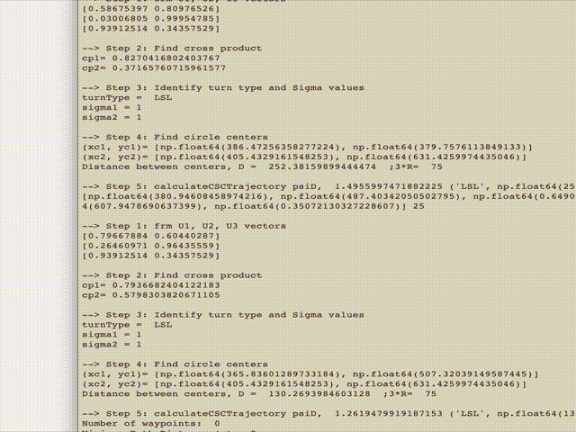

# MotionPlanning
Assignments for Udemy Course: 
Motion Planning for Nonholonomic vehicles 

### Dubins curve with Rapidly exploring Random Trees (RRT)

[MotionPlanning/DubinsCurve/Asn2_RRTDubins.py](./DubinsCurve/Asn2_RRTDubins.py)

### Dubins curve with Rapidly exploring Random Trees Star (RRT*)

[MotionPlanning/DubinsCurve/Asn3_RRTStarDubins.py](./DubinsCurve/Asn3_RRTStarDubins.py)
