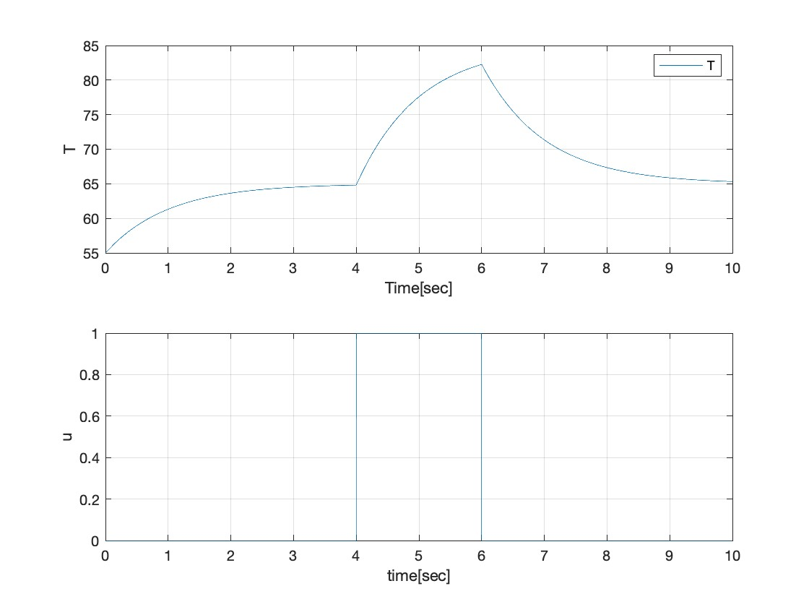
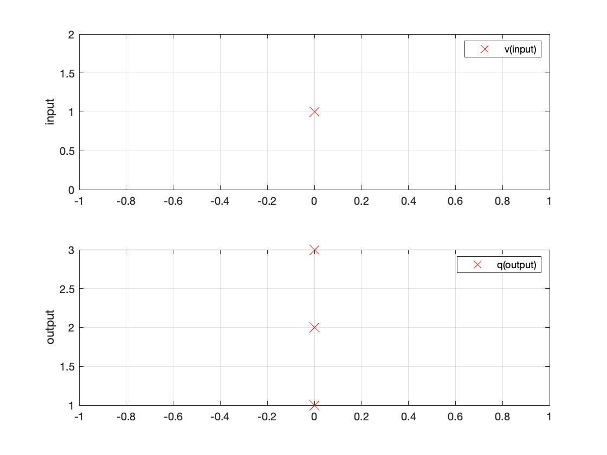
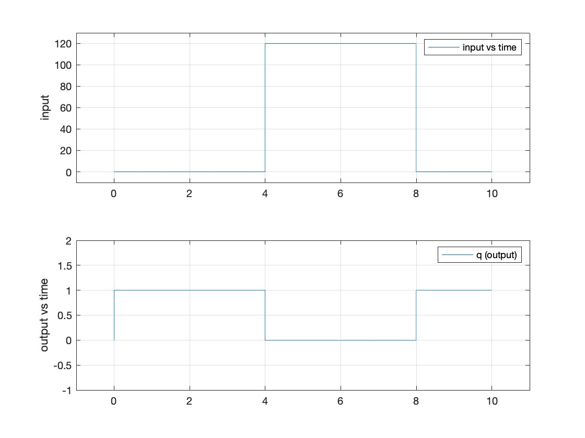

This folder contains model simulations for cyber physical systems. 

**Discrete time simulation model**

The variables contain the state of the system for for Ground vehicle simulation with the following. 

|Variable|Description|Represention in model|
|-|-|-|
|v1|Velocity the of the system considered to be constant|Contant block|
|v2|Angular adjustment of the steer|Signal pulse active between 4-6 seconds on a 10seconds pulse|
|x1|Horizontal position|state block with feedback|
|x2|Vertical position|''|
|x3|Angle between Orientation of the vehicle with horizontal axis|''|

**Constant time simulation model**

The variables are the same as above but the simuation is done using continous time plant for Ground vehicle simulation.

**Constant time model for temperature in a room**

For a change in temperature, Tdot represented by the formula below, simulate the model. 

$ Tdot = -a*x + Tr + (Tdelta*u); $

- Tdot = Next state of temperature. 
- a = chage rate in temperature of the room.
- x = curent state of temperature. 
- Tr = Outer room poperties affecting temperature.
- Tdelta = change in temp caused by a input source which is indicated by u ( as on or off )

The following graph is an example simulation for the values below. 
- a=1;
- Tr=65;
- vTdelta = 20;

**Finite states model**
For a model that has finite states, the movement between states can be done with the logic representing a truth table. 

The following plot is an example where the temperature influences the heat source on or off. 

